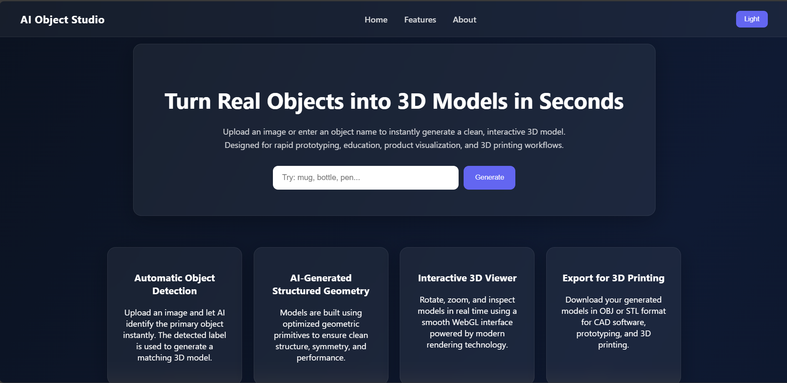
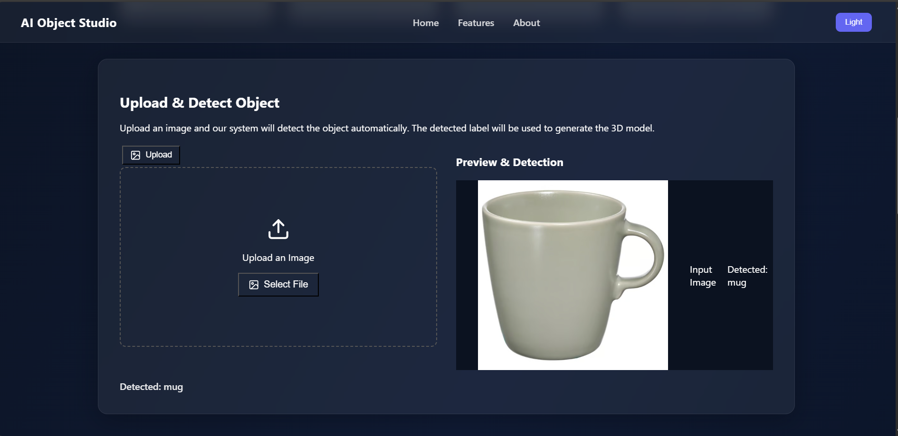
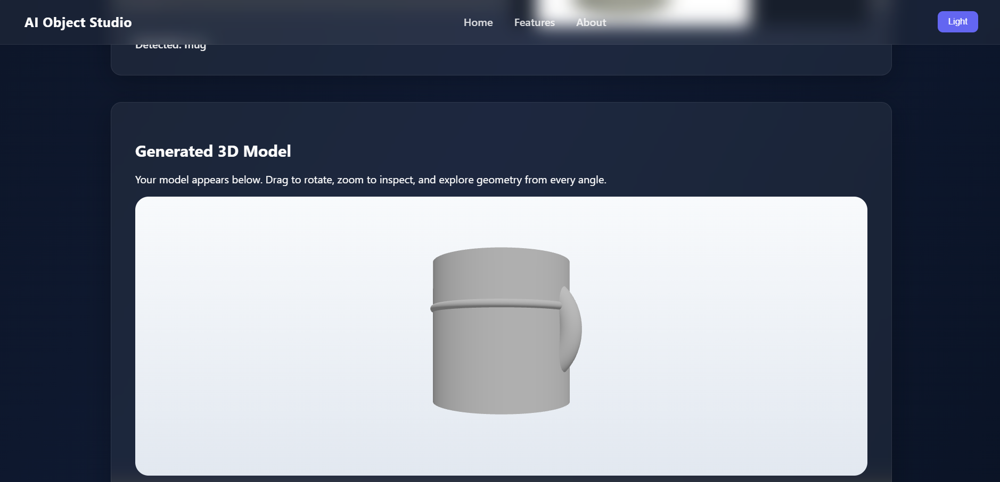
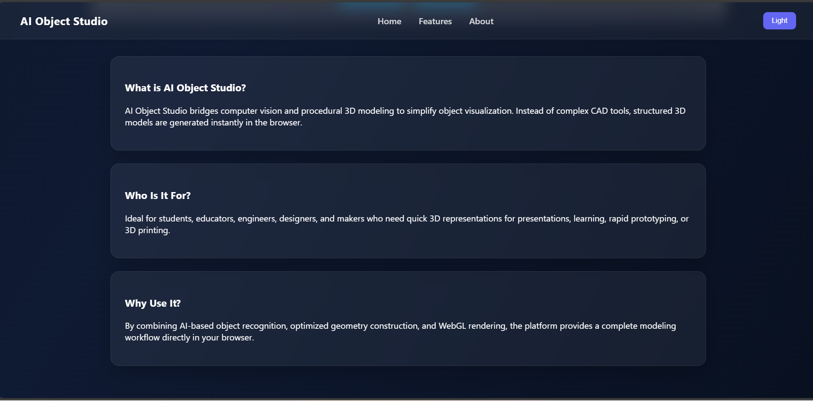
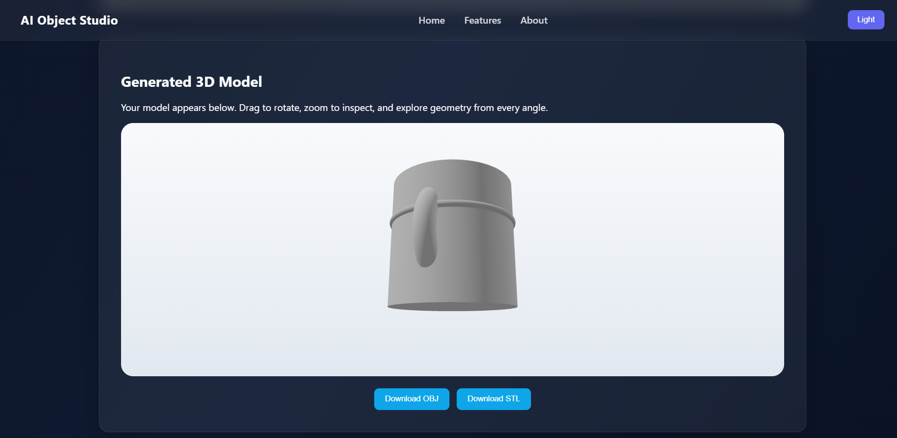

# AI Object Studio

## Transform real-world objects into clean 3D models instantly

AI Object Studio is a browser-based application that converts everyday objects into structured 3D models using image detection and procedural geometry generation.

Instead of complex CAD workflows, users can upload an image or enter an object name to generate an interactive 3D model ready for visualization, learning, or 3D printing.

The platform combines computer vision, procedural modeling, and WebGL rendering to deliver a complete 3D workflow directly in the browser.

---

## What this project is about

AI Object Studio simplifies the creation of 3D models from real-world objects. Traditional 3D modeling tools require technical expertise and time.

This application removes that barrier by automatically detecting an object and generating a clean geometric model that can be explored and exported.

**Goal:** make 3D visualization accessible for education, rapid prototyping, and creative experimentation.

---

## Where it can be used

This system is useful across multiple domains:

### Education & Learning

* Understanding 3D geometry and object structure
* Visual learning for students

### Rapid Prototyping

* Quickly generating base models for product concepts
* Idea visualization before detailed CAD modeling

### Design & Concept Development

* Creating quick reference models
* Early-stage product visualization

### 3D Printing Preparation

* Exporting printable models
* Creating base shapes for refinement

### Computer Vision & AI Demonstrations

* Demonstrating object detection workflows
* Teaching AI-assisted modeling pipelines

---

## How it works

The application uses a **two-stage pipeline**:

---

### 1. Object Detection (Model 1)

When a user uploads an image:

1. The image is processed by an object detection model.
2. The model identifies the primary object.
3. The detected label (e.g., **mug**, **bottle**) is returned.

This label becomes the input for model generation.

---

### 2. Procedural 3D Model Generation (Model 2)

Instead of generating complex mesh geometry, the system constructs a **clean procedural model** using optimized primitive shapes.

**Examples**

* Mug → cylinder body + curved handle
* Bottle → cylindrical body + neck
* Box → cube primitives

**Why primitives?**

* Clean geometry
* Fast rendering
* Lightweight models
* Easy export for 3D printing
* Educational clarity of shape construction

This structured modeling approach is ideal for rapid prototyping and learning.

---

### 3. Interactive 3D Rendering

The generated model is rendered using **Three.js**:

* Rotate and inspect the model
* Zoom and explore geometry
* Real-time WebGL rendering

---

### 4. Export for 3D Printing

Users can download generated models in:

* **OBJ format** — widely supported in CAD and 3D software
* **STL format** — standard format for 3D printing

---

## Application Workflow

1. Upload an image **or** type an object name
2. System detects the object
3. A procedural 3D model is generated
4. Explore the model in the viewer
5. Export as OBJ or STL

---

## Screenshots


### Homepage

**Description:** Landing section with title and input box.

```


---

### Detection Panel

**Description:** Upload interface with preview and detected label.



---

### 3D Viewer

**Description:** Interactive 3D viewer displaying generated object.



---

### Features Section

**Description:** Feature cards and UI layout.



---

### Export Options

**Description:** OBJ & STL download buttons.


---

## How to run this project

### Requirements

* Node.js 18+
* npm or yarn

---

### 1. Clone the repository

git clone https://github.com/YOUR_USERNAME/ai-object-studio.git
cd ai-object-studio
```

---

### 2. Install dependencies


npm install
```

---

### 3. Configure environment variables (if required)

Create:

```
.env
```

Add:

```
VITE_DETECTION_API_KEY=your_api_key_here
```

---

### 4. Start development server

```bash
npm run dev
```

Open:

```
http://localhost:5173
```

---

## How to use the application

### Generate from text

1. Enter an object name (mug, bottle, pen)
2. Click **Generate**

### Generate from image

1. Upload an image
2. System detects the object
3. Model generates automatically

### Export model

1. Generate model
2. Click **Download OBJ** or **Download STL**
3. Use in CAD or 3D printing software

---

## Technologies Used

* React + TypeScript
* Three.js (WebGL rendering)
* Vite
* Computer vision detection
* Procedural geometry modeling

---

## Design Approach

The system prioritizes:

* Clean geometry over heavy meshes
* Performance and fast rendering
* Educational clarity
* Print-ready structure
* Browser-based accessibility

---

## Future Improvements

* More object categories
* Advanced mesh refinement
* Texture generation
* Model scaling tools
* Model history & gallery

---
